# CyberKent

## Online Scam Detection and Reporting System

## User Guide

## About this guide

This guide explains how to use CyberKent, Hume City Council's CyberSafe
service, at <https://cyberkent.meroidea.com>. It has three parts, one for each
kind of user:

- **Part A, Residents:** checking a message, reporting a scam, following alerts, getting help.
- **Part B, Council officers:** reviewing reports, publishing alerts, tracking work.
- **Part C, Administrators:** the team, roles, content, categories and the audit trail.

Every part assumes only a web browser. Nothing needs installing. The service
works on phones, tablets and computers, in light and dark mode.

> A CyberKent result is advice, not a verdict. A low score does not prove a
> message is safe. If money has left your account, call your bank first, on
> the number on the back of your card. In an emergency, call 000.

## Part A: Residents

### A1. The home page

The home page explains the service and links to everything in it. The
**Services** menu at the top lists the main tools; **Report a scam** is always
in the top-right corner.

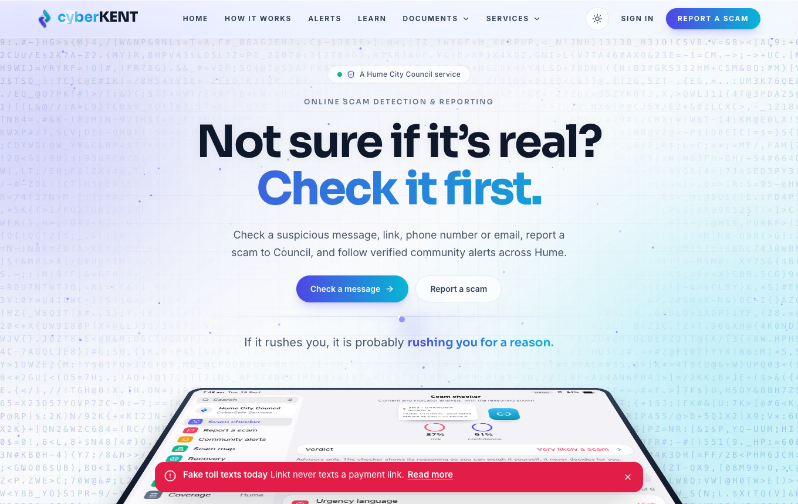

### A2. Check a suspicious message

You do not need an account to check a message.

1. Choose **Check a message** (or go to `/check`).
2. Pick how the message reached you: text message, email, phone call, website, social media or something else.
3. Paste the message, link, phone number or email address. You can also add up to four screenshots, photos or attachments (8 MB each).
4. Choose **Check this**.

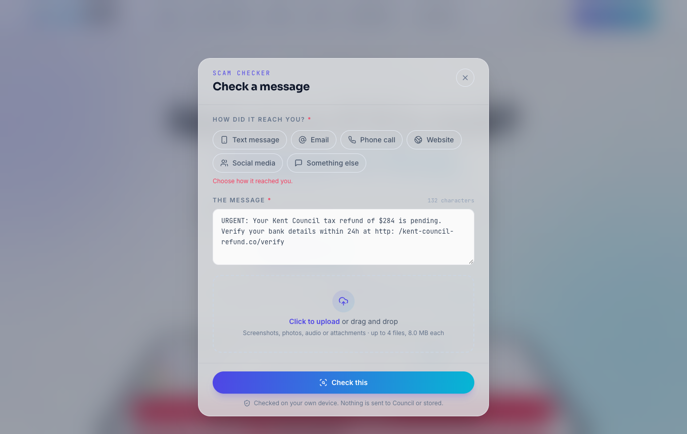

The check runs on your own device; nothing you paste is sent to Council or
stored. The result shows a risk score (low, medium or high), the warning signs
that were found and what to do next. When the AI service is available, an
**AI second opinion** adds the scam type, the manipulation tactics used and
the emotional pressure in the message. If the AI is unavailable, the rest of
the result is still complete. From the result you can go straight on to report
the scam, with what the checker found already filled in.

### A3. Create an account and sign in

Reporting a scam needs a free account, so an officer can follow up with you
and you can see what happens to your report.

1. Choose **Create a free account**.
2. Enter your name, email address and a password of at least 12 characters, and accept the terms of use.
3. Type the six-digit code sent to your email to confirm the account.

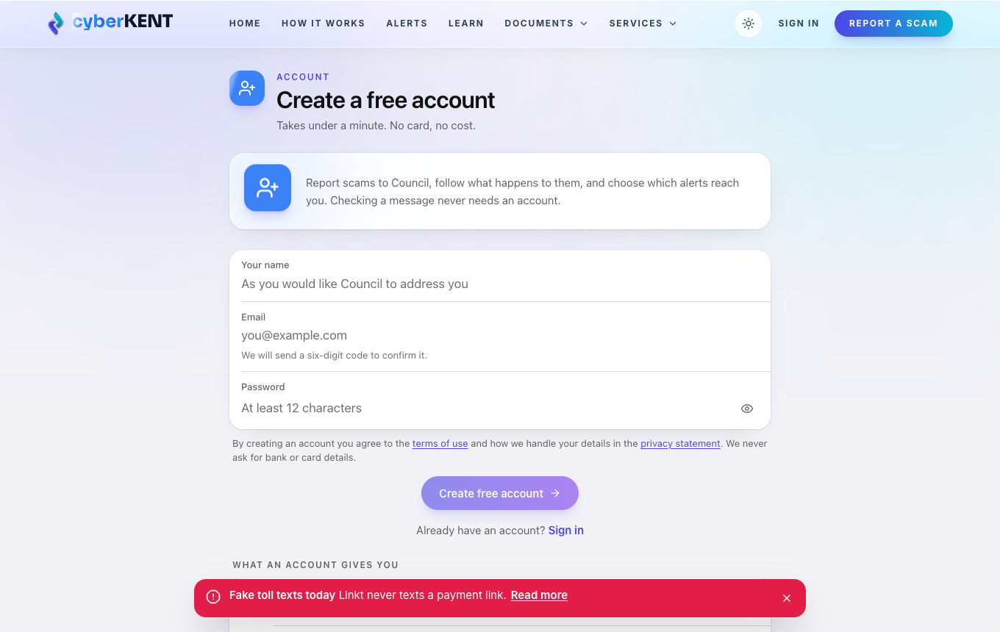

If you forget your password, choose **Forgot password** on the sign-in page and
follow the emailed link.

### A4. Report a scam to Council

1. Choose **Report a scam**.
2. Describe what happened: how it reached you, when, your suburb, the scam category and any money lost.
3. Attach evidence if you have it: screenshots, photos or documents. Files are checked and encrypted; anything disguised as a harmless file is refused.
4. Submit. You receive a reference number (for example `HCC-…`) by email.

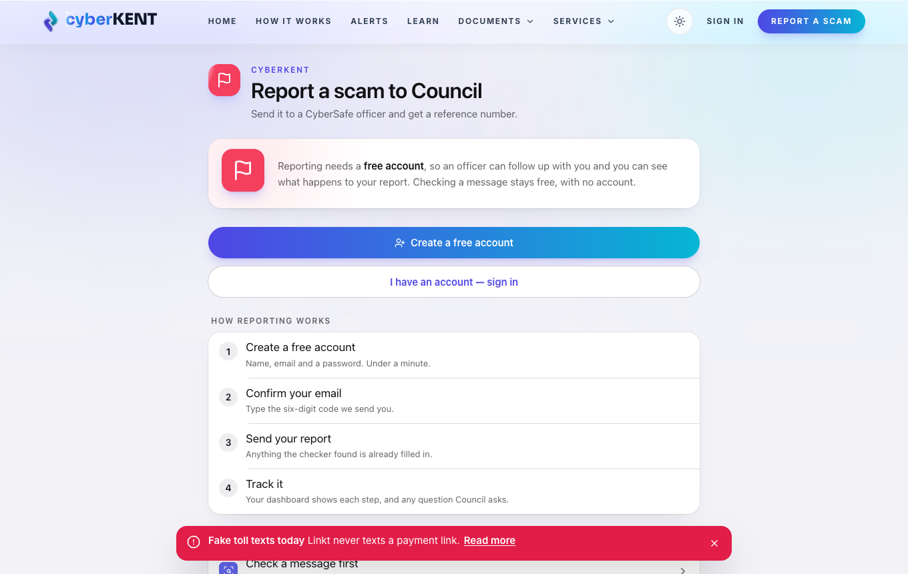

### A5. Track your reports

**Your dashboard** (`/account`) lists your reports and where each one is:
submitted, under review, more information requested, approved, rejected or
withdrawn. If an officer asks a question, it appears on the report and you
answer it there. You can withdraw a report you no longer want reviewed.

### A6. Follow community alerts

**Community alerts** (`/alerts`) lists scams Council has verified in Hume, with
what the scam looks like and what to do. Search by words, or filter by
category, suburb and severity. Alerts never contain the name or details of the
person who reported them.

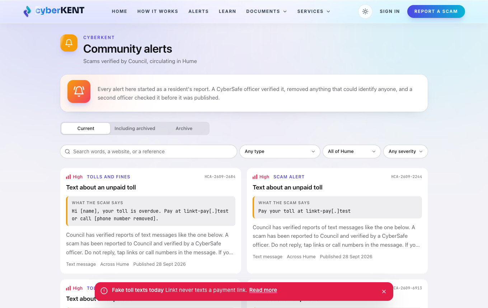

To be told about new alerts, subscribe on the home page (the **Stay
informed** section) or in **Settings**, choosing the suburbs and scam types you
care about. Every alert email has a one-click unsubscribe link.

### A7. See where scams are being reported

The **Scam map** (`/map`) shows where reports are clustering across the
municipality, by suburb. No individual report can be identified from it.

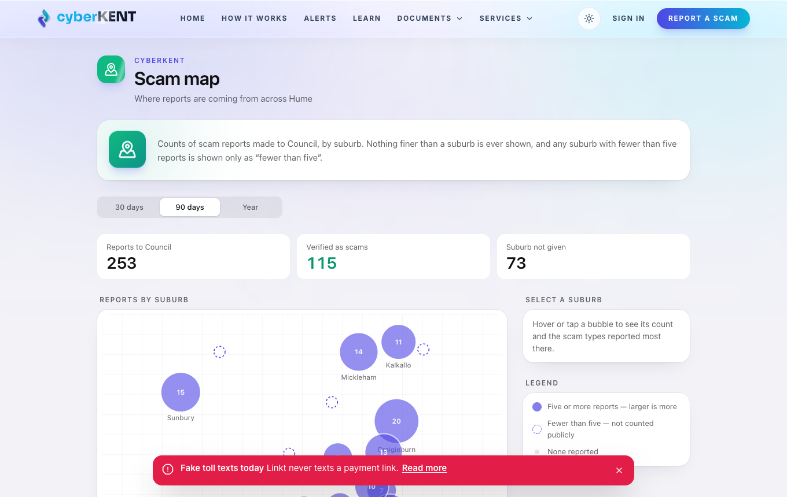

### A8. Learn to spot scams

The **Awareness library** (`/learn`) has short guides to the common scams, the
warning signs and how to protect yourself and your family.

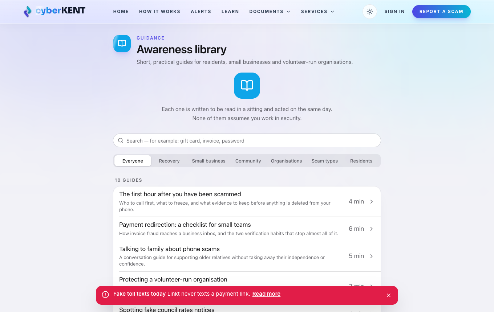

### A9. Recover after a scam

**Recovery checklists** (`/recover`) give step-by-step actions in the order
that matters: the first hour, money sent, bank details given away, identity
documents taken, remote access given, and more. Tick steps as you go; when you
are signed in, your ticks are saved.

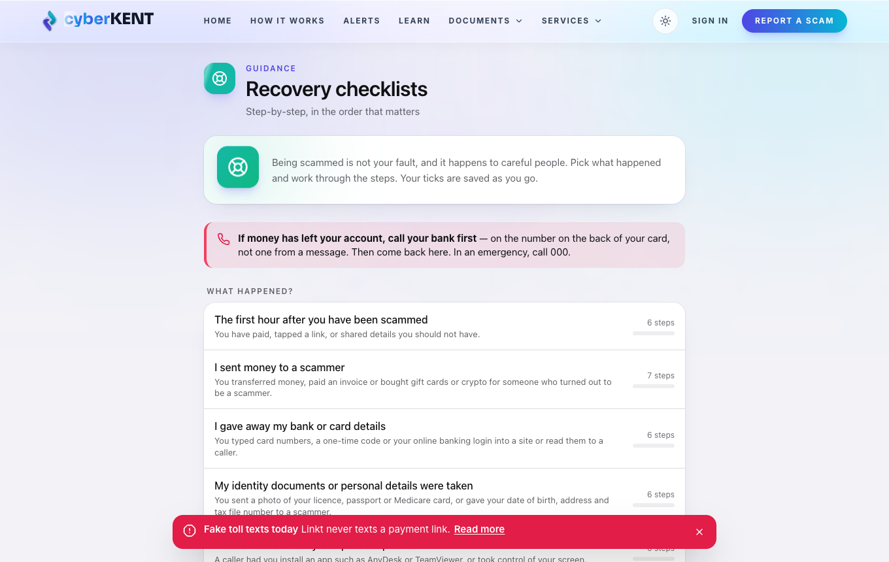

### A10. Ask the CyberSafe Assistant

The **CyberSafe Assistant** (`/assistant`) answers questions in plain language:
"Is this text from my bank real?", "What do I do if I paid a scammer?". It
gives general guidance, not legal or financial advice. If a message suggests
someone may be at risk of harm, it shows crisis support numbers instead of an
AI answer.

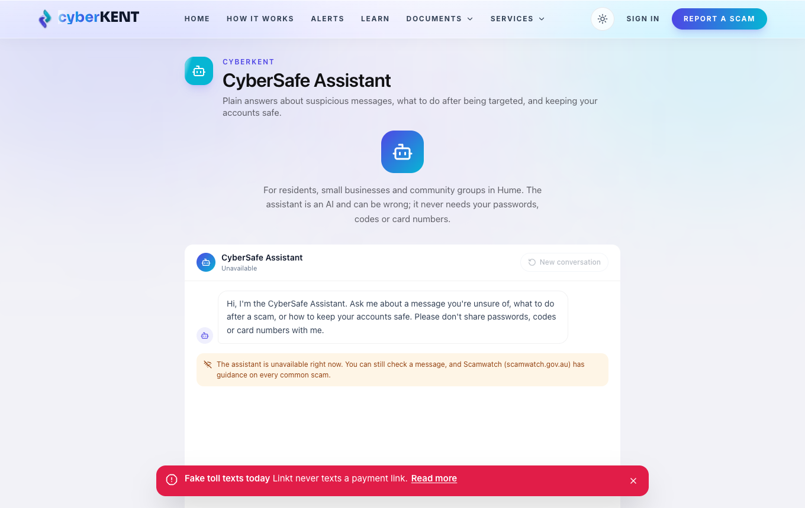

### A11. Your account and your data

In **Settings** you can change your name, password and notification
preferences, manage alert subscriptions and ask for your account to be
deleted. The **Privacy** page explains what is kept, for how long and why.

## Part B: Council officers

Officers sign in with the account Council created for them. After signing in,
the console sidebar shows the **Council** and **Admin panel** sections.

### B1. Council overview

**Council overview** (`/council`) summarises the caseload: new and waiting
reports, alerts awaiting approval, and trends over the last days and weeks.

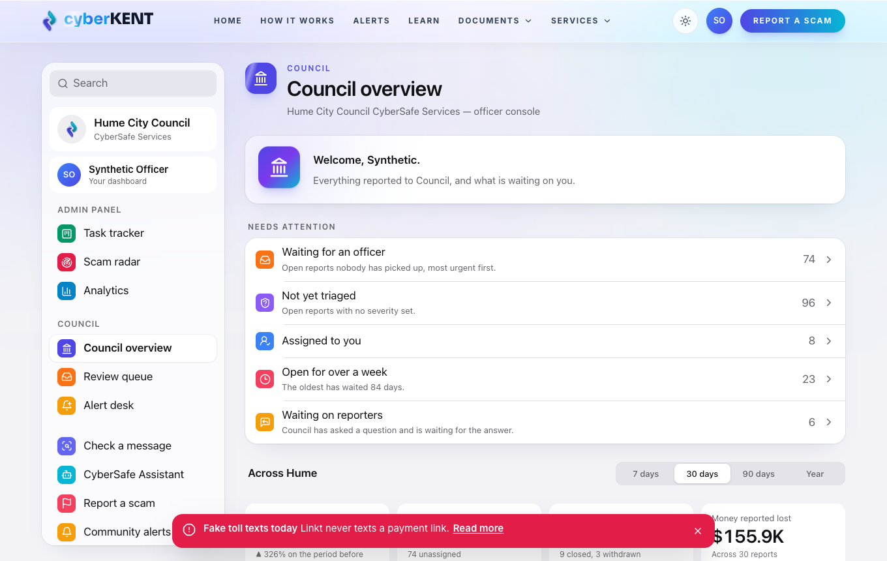

### B2. Review reports

1. Open the **Review queue** (`/council/queue`). Reports are listed oldest first; filter by status, category or suburb, or search by reference.
2. Open a report to see the description, the checker's findings, the evidence and any linked reports. Opening a piece of evidence is logged.
3. Assign it to yourself, then record your decision: approve (with a severity), reject (with a reason), or **request more information** from the resident.
4. Link reports that are part of the same campaign, so patterns are visible.

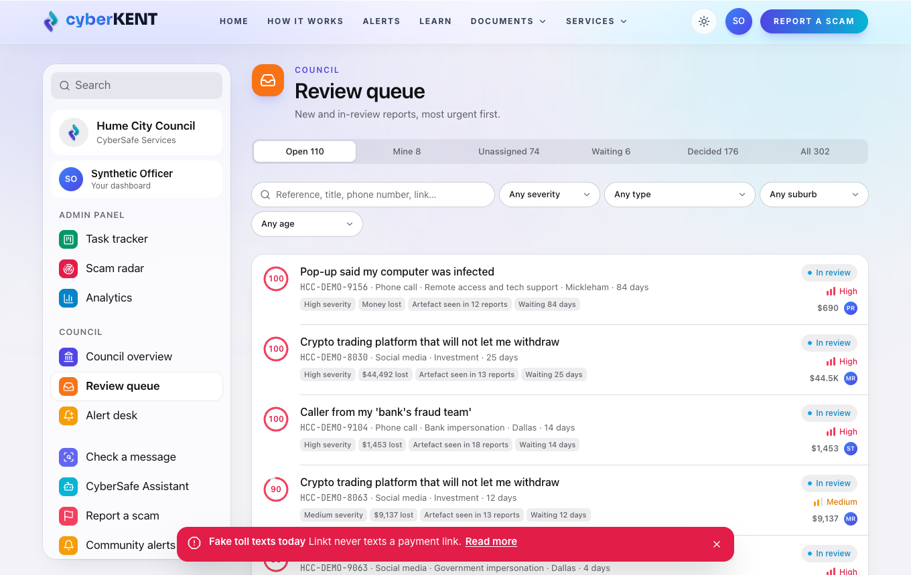

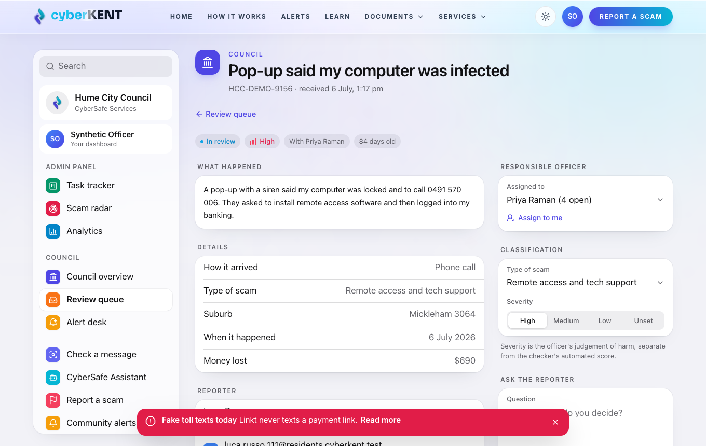

### B3. Publish a community alert

1. Open the **Alert desk** (`/council/alerts`) and start an alert, from scratch or from an approved report.
2. Write the headline, what the scam looks like and what residents should do. Personal details are removed automatically; check the draft before sending it on.
3. Submit it for approval. **A second officer must approve it** before it is published; nobody can approve their own alert.
4. On publication, subscribers who match the alert's suburb and category are emailed once. Archive an alert when it no longer applies.

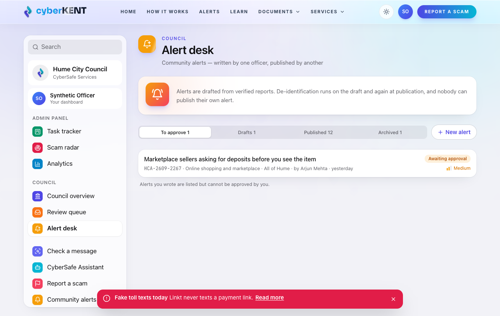

### B4. Track work in the task tracker

The **Task tracker** (`/council/tasks`) is the team's to-do board.

- Filter with **All open**, **Mine**, **Unassigned** and **Overdue**, or search by title, `TASK-` reference, report reference or label.
- Switch between **Board** (drag a card between To do, In progress, Blocked and Done) and **List**.
- **New task** creates one; tie it to a report and it links straight to the case. The assignee is told in their console and by email.
- **Suggested from what is waiting** proposes tasks for reports and alerts that have been waiting too long.

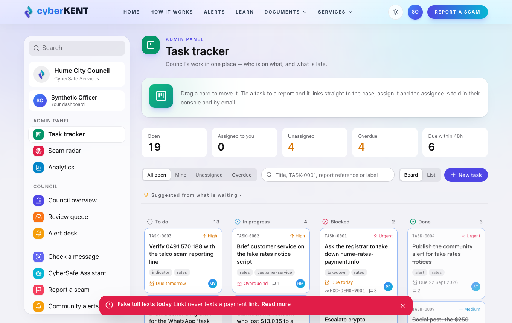

### B5. Analytics and the scam radar

**Analytics** (`/council/analytics`) charts reports by category, channel,
suburb and time, and exports a de-identified dataset. The **Scam radar**
(`/council/radar`) groups similar recent reports into campaigns, so a new wave
of the same scam is spotted early.

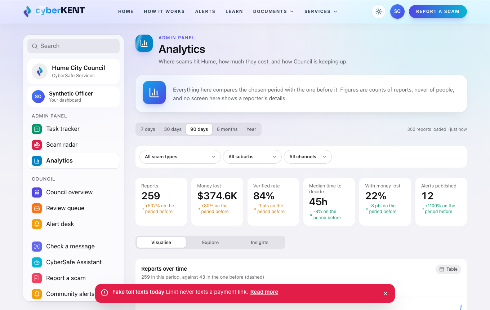

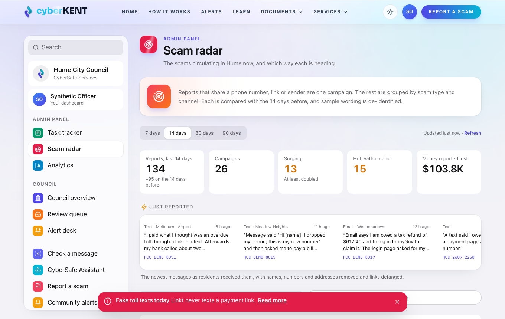

## Part C: Administrators

Administrators can do everything an officer can, plus the pages below. A
**super administrator** can also appoint and remove administrators; there is
always at least one.

### C1. Admin home

**Admin home** (`/admin`) brings together open tasks, the team, content and
site notices.

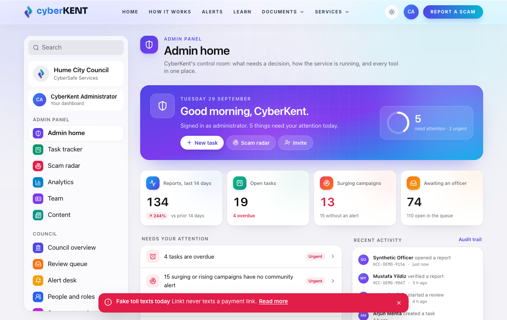

### C2. Team, people and roles

- **Team** (`/admin/team`) lists Council staff with their job titles and departments, and invites new officers by email.
- **People and roles** (`/council/users`) lists every account. Change a person's role (resident, business, officer, administrator) or suspend an account. A demoted officer loses access on their next request, not when their session expires.

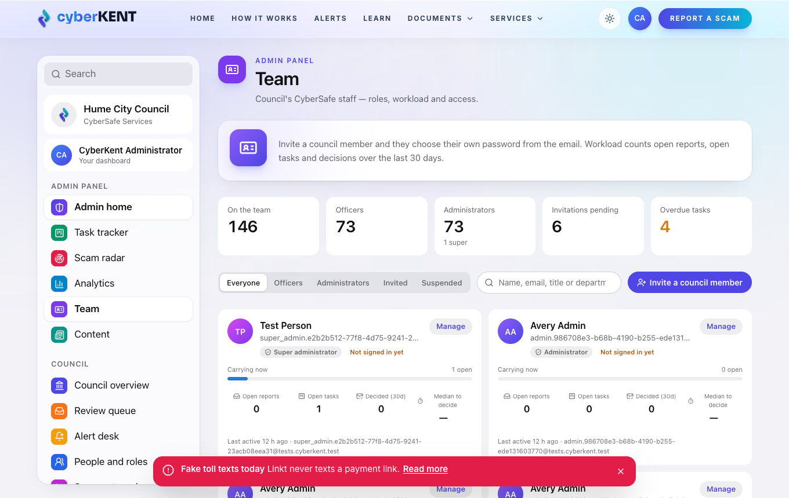

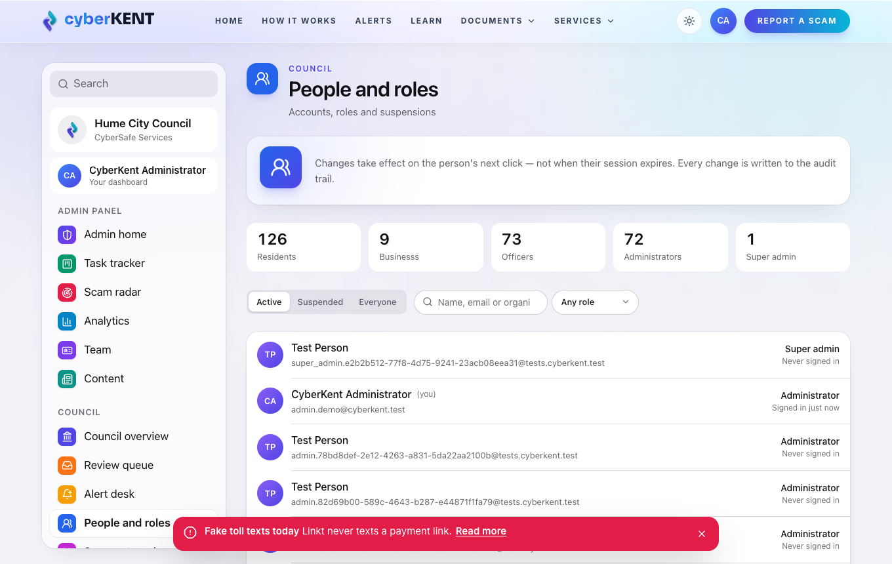

### C3. Content and site notices

**Content** (`/admin/content`) is where administrators write and publish the
awareness guides, and schedule **site notices**: the banner across the public
site, such as "Fake toll texts today". A notice has a tone (information,
warning or critical), an optional link, and a start and end time. A guide stays
private until it is published.

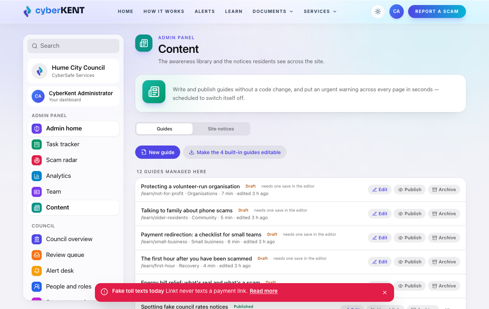

### C4. Scam categories

**Scam categories** (`/council/categories`) holds the categories residents and
officers choose from, based on Scamwatch's list. Add, rename or retire a
category; a retired category stays on old reports.

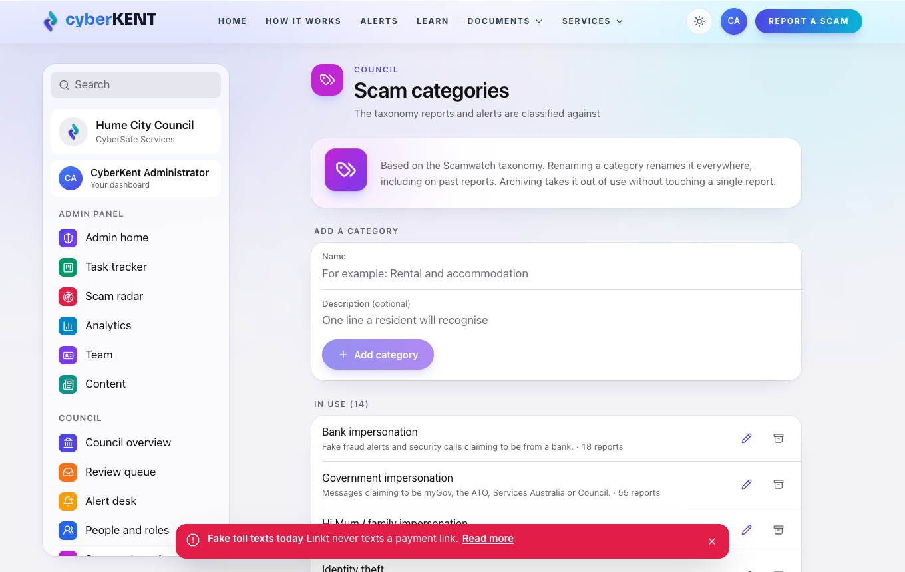

### C5. Audit trail

The **Audit trail** (`/council/audit`) records who did what and when: sign-ins,
role changes, report decisions, evidence access, alert approvals. It cannot be
edited. Filter by person, action, record type or period.

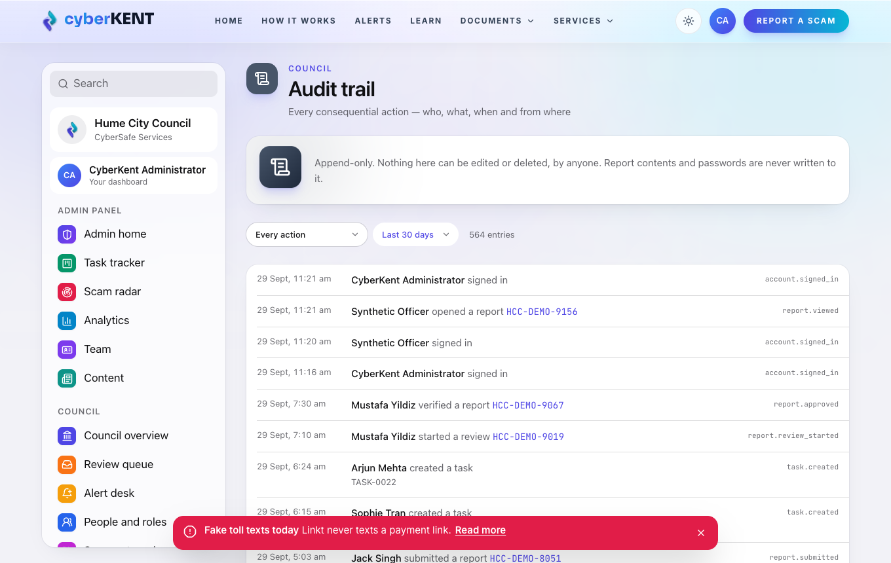

## Getting help

- **In the service:** the CyberSafe Assistant, the awareness library and the recovery checklists; each form explains its own fields.
- **Council:** CyberSafe Services, Hume City Council, 1079 Pascoe Vale Road, Broadmeadows VIC 3047, phone 9205 2200, email info@cyberkent.meroidea.com.
- **Scamwatch:** <https://www.scamwatch.gov.au> to report nationally.
- **Emergency:** 000. **Lifeline:** 13 11 14.

The technical setup (installing, running, testing and deploying) is in
`README.md` at the root of the repository.
